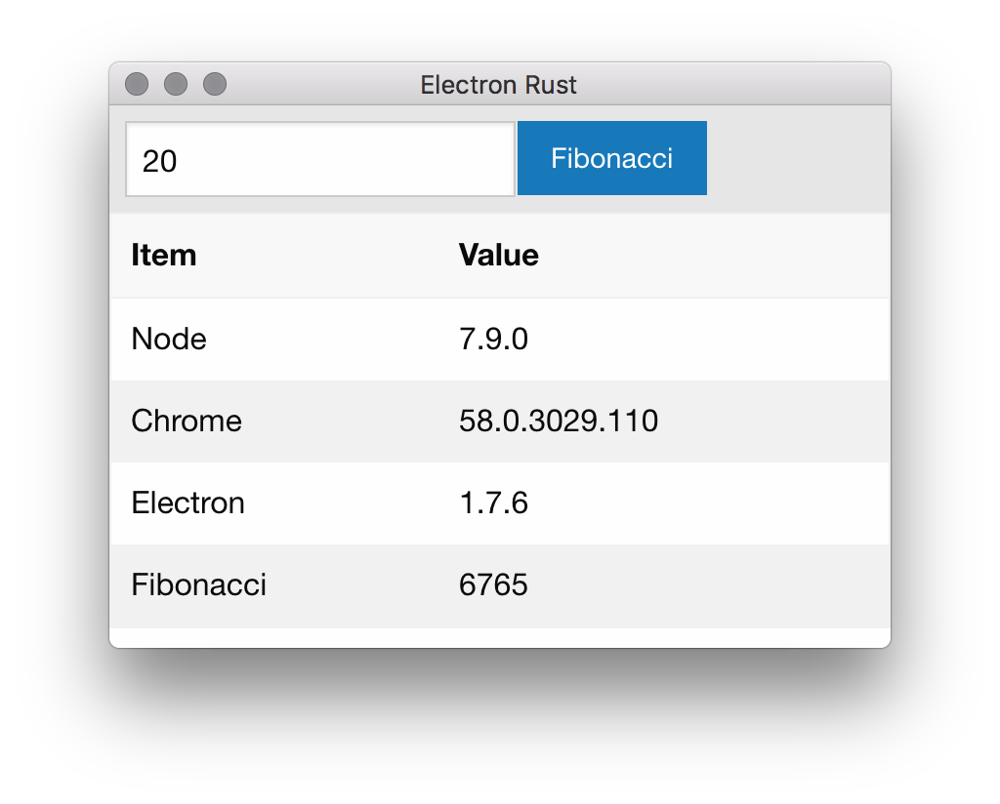

# Electron Rust
Demo electron to rust app.

## Requires

* Rust
* Node

and fun!

## Build & Run

* `npm install` will download required node packages.
* `cargo build` will download and build the rust source.
* `./node_modules/.bin/electron-rebuild` will rebuild the electron and ffi.
* `npm start` will start the app.
